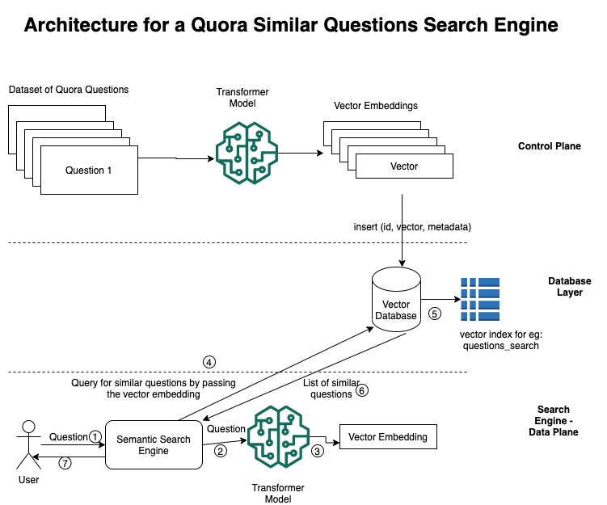

# What
This repo is a learning exercise for understanding how to use a vector database. This particular repo implements Semantic Search use case on Quora questions. The process is as below:
- Quora questions dataset is downloaded from HuggingFace maintained datasets
- All the questions are transformed to vector embeddings using Transformer model
- All vector embeddings are stored in pinecone vector database
- User can type any question
- Question is transformed to its vector embedding
- Vector embedding is sent to pinecone as part of a query
- Pinecone returns the similar questions
- User is shown the similar questions with associated score

# Why
It seems that the there is a new application platform emerging with the rise and popularity of LLMs (for eg ChatGPT). Similar to web, mobile,cloud wave, this new paradigm looks promising and worth looking into. For eg: in web world we have the MERN stack, in mobile world we have Android/ios stack and so on. The new generation of applications emerging will be built on top of the LLMs. This also requires a stack to allow developers to build applications. Based on my limited understanding, this new stack is LangChain (or similar framework)/LLM (ChatGPT, OpenAI)/Vector Database.
  This repo is my first step in getting my feet wet with this stack. For now, am starting backwards, with understanding the vector database. But this use case has given me enough context to understand how the dots are connected.

# Architecture

# How to run
## Setting up Pinecone
1. Create a free account on Pinecone here.
2. Create an index and make sure the dimensions is set to 384
3. Create an API key. Copy Index name,namespace, API Key and Environment in `constants.py` file

## Setting up Dependencies:
`!pip install -r requirements.txt`

## Running Control Plane
1. Run: `python control_plane.py`
2. This will download the Quora dataset and upsert the vector embeddings to Pinecone. Have some patience as this process can take time
3. Once the upserts are completed, you can go to Pinecone and check vectors available in the index
`
## Running Data Plane (semantic search)
1. Run: `python data_plane.py <question>
2. You should see a list of similar questions and their associated score

# Learnings:
1. Hugging faces public datasets are available via the `datasets` package
2. Quora dataset comprises of questions
3. How HuggingFace datasets uses Apache Arrow for its data format. More info here:
https://huggingface.co/docs/datasets/about_arrow#:~:text=Datasets%20%F0%9F%A4%9D%20Arrow,-What%20is%20Arrow&text=It%20is%20a%20specific%20data,it%20supports%20different%20programming%20languages.
4. Various pre-trained models available via sentence transformers package
5. How to use a vector database to do semantic search on textual data